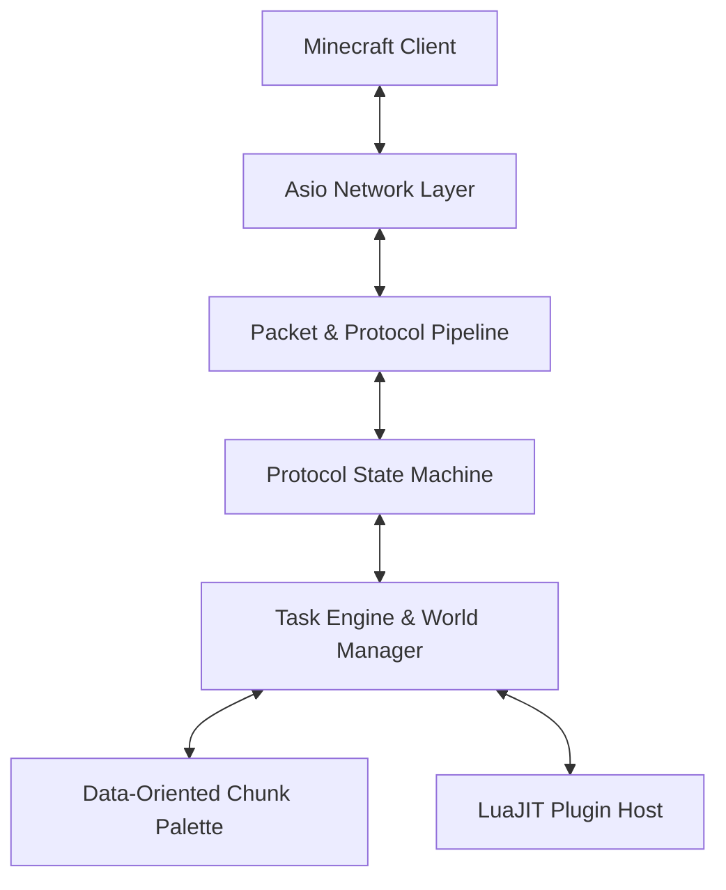

# PaperMC++ Engine Architecture Blueprint

## 1. Executive Summary & Design Goals
PaperMC++ is engineered from the ground up as a zero-overhead, multi-threaded C++23 Minecraft Java Edition server core. Traditional Java-based server implementations (PaperMC, Spigot) suffer from Garbage Collection pauses, high memory footprints, and JVM runtime abstractions. 

PaperMC++ replaces these abstractions with:
1. Direct memory layout control and cache-aligned Data-Oriented Design (DOD).
2. Monadic exception-free error handling using `std::expected`.
3. Standalone `asio` event loops operating on non-blocking async sockets.
4. An embedded, zero-JIT-overhead scripting layer (LuaJIT / Sol2).

---

## 2. System Layer Topology

### 2.1 Networking & Protocol Pipeline
- **Network I/O:** Uses standalone `asio::io_context` with socket pool threads. Packet ingestion runs on async read handlers without memory allocation per packet.
- **Byte Buffer Handling:** `papermc::protocol::ByteBuf` utilizes zero-copy `std::span<const std::byte>` operations for parsing and serialization.
- **VarInt Encoding:** VarInts and VarLongs implement branch-predicted bit manipulation according to wiki.vg specification.
- **Encryption & Compression:** Packet pipeline supports AES-128-CFB stream encryption and Zlib payload compression via standard C++ interfaces.

### 2.2 Game World & Chunk Memory Architecture
Minecraft Java 1.20+ worlds consist of 16x384x16 height chunks divided into 24 sub-chunk sections of 16x16x16 blocks.

- **Direct Memory Array & Palette:** Sub-chunks store blocks via indirect palette mapping:
  - Global Palette / Direct Palette mapping using compressed bit-packed array structures.
  - Structure packing with alignas guidelines (`alignas(64)` cache line alignment for chunk sections).
- **Thread Safety:** Chunk data uses fine-grained read-write synchronization (`std::shared_mutex` or atomic updates per sub-chunk section), enabling multi-threaded tick generation and asynchronous chunk generation/compression.

### 2.3 Monadic Error Handling Strategy
Exceptions introduce hidden control flow branches and stack unwind overhead. PaperMC++ uses `std::expected<T, std::string_view>` or structured system error codes across all protocol deserialization and network read/write paths.

---

## 3. Python AI Multi-Agent Swarm Integration

The project features a standalone agent architecture residing in `./agents/`:
- **`config.py`**: Model Pool Failover Manager supporting Gemini 2.5 Flash, Groq LLaMA-3.3-70B / DeepSeek R1, and OpenRouter Free endpoints with automatic 429 backoff and fallback.
- **`architect_agent.py`**: Converts protocol documentation and feature requests into detailed C++23 task specs.
- **`coder_agent.py`**: Autonomously produces memory-safe, standard-compliant C++ headers and source files.
- **`git_agent.py`**: Enforces strict C++ code formatting (`clang-format`) and issues semantic git commits (`feat(...)`, `fix(...)`, `refactor(...)`).
- **`orchestrator.py`**: Autonomous controller driving feature development loop.
